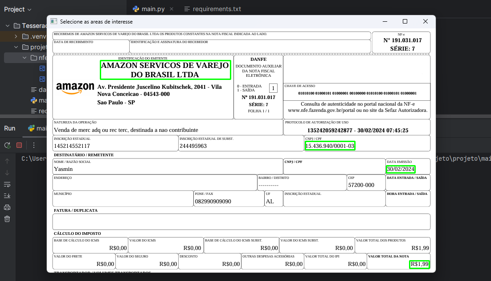

# Extração Automática de Informações de Notas Fiscais (DANFE) com Python

## Descrição do Projeto
Este projeto foi desenvolvido para automatizar o processo de extração de informações de Notas Fiscais Eletrônicas (DANFE) utilizando Python. O sistema é capaz de ler imagens de notas fiscais e organizar os dados extraídos em um arquivo CSV. As bibliotecas utilizadas incluem OpenCV para manipulação de imagens e Tesseract para reconhecimento óptico de caracteres, além de Pandas para o tratamento e armazenamento dos dados.



## Funcionalidades
- Extração de dados estruturados de imagens de DANFE.
- Desenho interativo de retângulos para seleção de regiões de interesse na imagem. 
- Reconhecimento de texto utilizando Tesseract. 
- Organização e manipulação dos dados com o uso de Pandas. 
- Geração automática de um arquivo CSV contendo as informações extraídas.

## Tecnologias Utilizadas
- **Python**: Linguagem de programação principal.
- **OpenCV**: Para manipulação de imagens.
- **Tesseract**: Para reconhecimento óptico de caracteres..
- **Pandas**: Para organização e tratamento de dados em tabelas e geração do CSV.

## Pré-requisitos
Antes de executar o projeto, é necessário instalar as seguintes dependências:

```bash
pip install -r projeto/docs/requirements.txt
